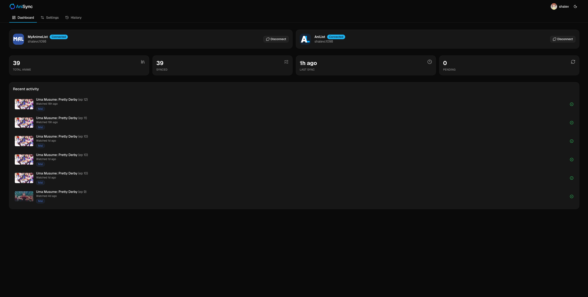
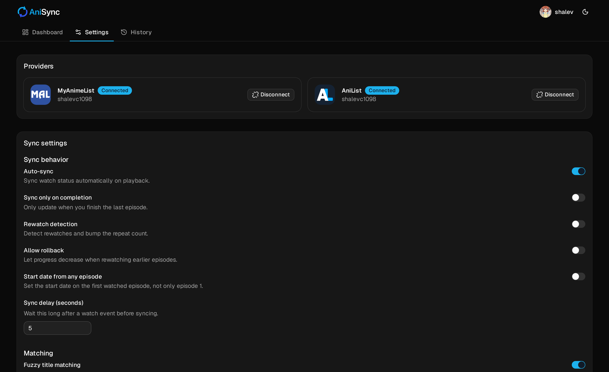
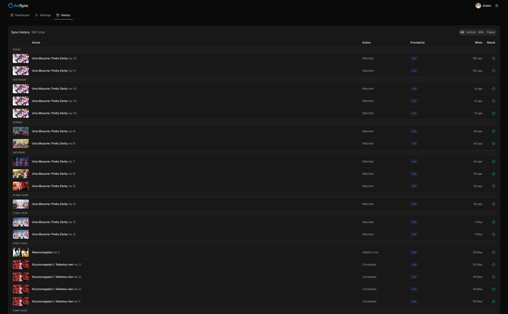

<div align="center">


# AniSync

**Sync your Shoko watch status to AniList _and_ MyAnimeList - automatically, to both at once.**

</div>

AniSync is a [Shoko Server](https://shokoanime.com) plugin that watches your episode
progress and keeps your **AniList** and **MyAnimeList** lists in sync. Mark an episode
watched in Shoko (or any Shoko-connected player) and it updates both providers -
progress, status, rewatches, and start/finish dates - with a clean web dashboard to
manage everything.

## Features

- **Dual-sync** to AniList + MyAnimeList from a single watch event.
- **Per-user** - each Shoko user connects their own accounts.
- **Smart matching** - resolves provider IDs from the anime-offline-database (cached per
  watch), with fuzzy title-matching as a fallback.
- **Rewatch detection**, optional progress rollback, and flexible start-date handling.
- **Grouped history** - one row per watch with a badge per provider and episode stills.
- **Modern web UI** - dashboard, settings, and history; light/dark; mobile-friendly.

## Screenshots

| Dashboard | Settings | History |
| --- | --- | --- |
|  |  |  |

## Requirements

- **Shoko Server** with the plugin API (built against `Shoko.Abstractions` 6.0.0-alpha.24).
- **.NET 10 SDK** and **Node.js** (to build).
- A **MyAnimeList** API app and/or an **AniList** API client (for OAuth - see below).

## Install

1. Build the plugin (see [Development](#development)) to produce `Shoko.AniSync.dll`.
2. Drop the DLL into Shoko's `plugins/` folder.
3. Restart Shoko. The plugin serves its UI at `/anisync`.

## Configuration

1. **Create the provider API apps** (use your own - each needs a redirect/callback URL of
   `https://<your-shoko-host>/anisync/authCallback`):
   - **MyAnimeList** - <https://myanimelist.net/apiconfig>
   - **AniList** - <https://anilist.co/settings/developer>

   Note each app's **Client ID** and **Client Secret**.

2. **Enter the credentials** - open `/anisync` as a Shoko **admin** > **Settings > API
   configuration** > paste the Client IDs/Secrets > **Save**.

3. **Connect your accounts** - on the **Dashboard**, click **Connect** for AniList and/or
   MyAnimeList and authorize. Each Shoko user connects their own accounts.

4. Watch something - progress syncs to every connected provider.

## Settings

| Setting | What it does |
| --- | --- |
| Auto-sync | Sync watch status automatically on playback. |
| Sync only on completion | Only update when you finish the last episode. |
| Rewatch detection | Bump the repeat count on genuine rewatches. |
| Allow rollback | Let progress decrease when rewatching earlier episodes. |
| Start date from any episode | Set the start date on the first watched episode, not only episode 1. |
| Fuzzy title matching + threshold | Match titles loosely when no exact ID is found. |
| Sync delay (seconds) | Wait this long after a watch event before syncing. |
| Update NSFW | Include adult titles when syncing. |
| Debug logging | Verbose logs for troubleshooting. |

## How it works

On an episode watch event the plugin resolves the anime's provider IDs **once** (cached for
an hour), then for each connected provider it reads the current list entry, decides the
change (watch / rewatch / no-op), and updates it - writing **one grouped history entry per
watch**, shared across providers via an event id.

Watched/unwatched is read from Shoko's `LastPlayedAt`, not the sticky `IsWatched` flag, so
an unwatch is correctly detected instead of being re-synced.

## Development

Backend is C# / .NET 10; the frontend is React + Vite + TypeScript and is **built into the
plugin's `wwwroot/app`** and embedded in the DLL.

```bash
# 1. Build the web UI (outputs into Shoko.AniSync/wwwroot/app)
cd client && npm install && npm run build && cd ..

# 2. Build the plugin
dotnet build Shoko.AniSync/Shoko.AniSync.csproj -c Release

# 3. Copy the DLL into Shoko's plugins/ folder and restart Shoko
#    Shoko.AniSync/bin/Release/net10.0/Shoko.AniSync.dll

# Run the tests
dotnet test Shoko.Tests/Shoko.Tests.csproj
```

## Tech stack

**Backend:** C# / .NET 10 / Shoko.Abstractions
**Frontend:** React / Vite / TypeScript / TanStack Query & Form / Zustand / Tailwind CSS / shadcn/ui / lucide
